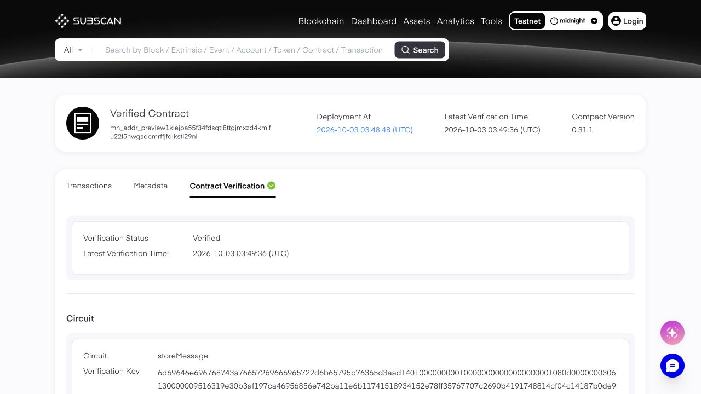

# Preview compilation, deployment and verification acceptance

On October 3, 2026, an authorized test wallet completed frozen multi-file source compilation, Preview deployment, Subscan source verification, an independent API read and public-page confirmation. Initial verification returned `verified` and `matchesBundle: true`; receipt-based resume returned `already-verified` and `matchesBundle: true`. Both runs exited with code 0.

## On-chain and verification evidence

| Item | Result |
| --- | --- |
| Network | Midnight Preview |
| Contract | [View verified contract](https://midnight-preview.subscan.io/contract/0xb7f320f6944c6a96c00bf9d6b44b66136b6dfd3c52bf49b9106e3634a64907ed?tab=contract) |
| Deployed address | `0xb7f320f6944c6a96c00bf9d6b44b66136b6dfd3c52bf49b9106e3634a64907ed` |
| Deployment block | `1130062` |
| Extrinsic | `1130062-3` |
| Source | `examples/multi-file/main.compact`, `examples/multi-file/lib/message.compact` |
| Source digest | `d12d540c17cd1906263d07ee6ca325fb44b0fcdfbcb4fb78c440d1ecb8f33da6` |
| Official Indexer | Initial deployed ledger readable; `message === ''` |
| Subscan persistence | `verify_time = 1790999376`, `verifying = false`, `last_verify_error = ""` |
| Source equality | Complete contents of both files, entry file and compiler version matched the frozen bundle |
| Public page | `Verified Contract`, `Verification Status Verified`, Compact `0.31.1` and the `storeMessage` circuit |

The success receipt is preserved in [preview-2026-10-03-receipt.json](preview-2026-10-03-receipt.json), with the test wallet address removed during the October 8 publication review. Public contract and transaction evidence remains unchanged. SDK transaction ID, Subscan transaction hash and deployment block hash are separate fields and must not be substituted for one another.



## Toolchain and infrastructure

| Component | Used in this run |
| --- | --- |
| Node / npm | `22.16.0` / `10.9.2` |
| Compact | `0.31.1` |
| Compact runtime | `0.16.0`, matching generated metadata and the installed SDK |
| Midnight.js / Wallet SDK | `4.1.1` / `1.2.0` |
| Proof server | Local test container `8.1.0` |
| Node RPC | `https://rpc.preview.midnight.network`, with corresponding WS |
| GraphQL Indexer | `https://indexer.preview.midnight.network/api/v4/graphql`, with corresponding `/ws` |
| Subscan API | `https://midnight-preview.api.subscan.io` |

SDK dependencies, wallet and provider configuration reused an existing `midnight-go/e2e` installation. The derived address matched the provided Preview address before network synchronization. No Blockfrost endpoint or additional Ops service deployment was required.

## Timing

Times below use Asia/Shanghai (UTC+08:00). JSON receipts use UTC ISO timestamps.

| Stage | Time |
| --- | --- |
| Compilation finished and receipt created | `2026-10-03 11:39:41` |
| Initial wallet synchronization completed | `2026-10-03 11:48:39` |
| Deployment included in a block | `2026-10-03 11:48:48` |
| SDK confirmed deployment and saved address | `2026-10-03 11:49:03` |
| Subscan verification succeeded | `2026-10-03 11:49:36` |
| Independent persisted-result assertions passed | `2026-10-03 11:49:44` |

The run took about 10 minutes from compilation completion to final API assertions, mostly waiting for initial wallet synchronization. This does not predict deployment duration for an already synchronized wallet or another network.

## Commands and reproduction

Run from this project directory. Keep the wallet file private and locally readable only. Preparation, proof-server setup and full options are documented in the [E2E instructions](../../e2e/README.md). The command below preserves the run's relative output directory and timeout settings while adding the current explicit `--compiler-version 0.31.1` option; the original harness used that version internally. Checkout and credential paths are portable placeholders. Supply your own file with an `X-API-Key` header; a Subscan backend checkout is unnecessary. Omit `--subscan-key-file` if `SUBSCAN_API_KEY` is set.

```bash
npm run test:live -- \
  --network preview --deploy \
  --compiler-version 0.31.1 \
  --out managed/live-preview-20261003 \
  --helper-dir /path/to/midnight-go \
  --env-file /path/to/private/.env.preview \
  --subscan-key-file /path/to/api-key.http \
  --sync-timeout-ms 1200000 \
  --verify-timeout-ms 600000
```

If this output directory already exists in your reproduction environment, choose a new directory. Deployment never overwrites existing artifacts. Temporary credential files, the local proof-server container and its Compose network were removed after the test. Runtime artifacts, private state and SDK logs remain in ignored directories and are excluded from source bundles and npm packages.

After stopping the proof server, receipt-based verification succeeded using only the public receipt and API key. It loaded no wallet and deployed or broadcast no transaction. The authentication-file path below is also a placeholder:

```bash
npm run test:live -- \
  --resume managed/live-preview-20261003/receipt.json \
  --subscan-key-file /path/to/api-key.http \
  --verify-timeout-ms 60000
```

The result was `already-verified`, `matchesBundle: true` and exit code 0. In general, resume may submit source for an unverified contract; this run had an existing success record and only read verification state.

## Local checks and acceptance boundaries

- `npm test`: 27/27 passed at the time of the live run, including mainnet rejection, explicit deployment mode and rejection of receipts without a confirmed address.
- `npm run check`: passed.
- `npm pack --dry-run`: passed; the manifest excluded runtime artifacts, private state, SDK logs and credential files.
- Live E2E and receipt-based resume: both exited 0; the public page confirmed success.

This establishes one complete successful Preview workflow for the Compact 0.31.1 multi-file example. Preprod, Mainnet, other compiler versions and verification after maintenance updates remain unvalidated. Server-side path, resource, complete-key-set, ordering and maintenance-version requirements are listed in [design and release boundaries](../design.md). At the time of this test, the npm package was unpublished; no backend/helper service was deployed during this test.

## Subsequent compiler configuration checks

Configurable compiler version, invocation mode and executable path increased the local suite to 34 passing tests. Direct compilation with a real `compactc` 0.31.1 executable generated `storeMessage.prover`, `storeMessage.verifier` and matching metadata for the same multi-file example. Its source digest matched this report's deployment snapshot. Output is retained in the ignored `managed/compactc-configurable-20261003/` directory. This additional check compiled only; it did not redeploy the contract.

Other version-selection behavior was tested with local compiler and HTTP fixtures, not live network compatibility checks. For direct invocation, use a trusted compiler entry in a complete toolchain installation with its supporting binaries and key-generation tools available.
