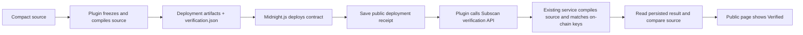

# Midnight Contract Compilation, Deployment and Verification Guide

This guide describes the workflow validated on Preview: freeze and compile the Compact source, deploy using the artifacts from the same output directory, save the public deployment receipt, and submit the frozen source to Subscan for verification. Results and page evidence from October 3, 2026 are available in the [Preview E2E report](e2e/preview-2026-10-03.md).

Install the CLI and library into your DApp with Node.js >= 22.16:

```bash
npm install --save-dev midnight-verify-plugin
npx midnight-verify --help
```

The CLI uses the same implementation as the JavaScript/TypeScript exports. The manual deployment harness below uses a source checkout and an existing Midnight.js SDK installation; ordinary verification through the npm package requires no wallet.

## Workflow and responsibilities



| Component | Responsibility and required configuration |
| --- | --- |
| Verify plugin | Freezes source, records the exact compiler version, submits verification and waits for the result. Verification requires only the public contract address, `verification.json` and a Subscan API key. |
| Midnight.js deployment script | Loads the generated contract and keys, deploys with a test wallet and proof server, and saves the public transaction ID, contract address and block hash. |
| Node RPC | Submits transactions; configured separately from the GraphQL Indexer. |
| Official GraphQL Indexer HTTP / WS | Supports wallet synchronization, deployment confirmation and public contract state queries. |
| Existing Subscan backend / midnight-go | Recompiles the source, verifies it against indexed on-chain keys, and persists the result. |

The validated run reused the existing SDK installation, official Preview RPC / Indexer, and Subscan verification service. Deployment used a local proof server. The client requires no Blockfrost endpoint or additional Ops Deployment. Verification publishes the selected Compact source; wallet secrets, private state and API keys are not verification inputs.

## 1. Prepare the environment

The validated combination was Node `22.16.0`, Compact `0.31.1`, Midnight.js `4.1.1`, Wallet SDK `1.2.0`, Compact runtime `0.16.0` and proof server `8.1.0`. The manual E2E adapter requires these SDK and wallet versions and checks that the generated contract's runtime version matches the installed SDK runtime.

The compiler version is configurable, not pinned to the validated version. Select an exact `x.y.z` version through `--compiler-version` or `MIDNIGHT_COMPACT_VERSION`; there is no implicit version default. For live deployment, Subscan must support that exact version and the generated runtime must match the installed SDK. Configurability does not establish network compatibility for every compiler release.

| Setting | CLI flag | Environment fallback | Default |
| --- | --- | --- | --- |
| Exact compiler version | `--compiler-version` | `MIDNIGHT_COMPACT_VERSION` | Required |
| Invocation mode | `--compiler-mode` | `MIDNIGHT_COMPACT_MODE` | `compact` |
| Executable or path | `--compiler-bin` | `MIDNIGHT_COMPACT_BIN` | Mode name on `PATH` |

Flags take precedence over environment variables. The `compact` mode runs `compact compile +<version> <source> <output>`. The `compactc` mode invokes the compiler directly as `compactc <source> <output>`; choose a binary of the requested version. In both modes, the generated compiler metadata must match the requested version and include circuit descriptions and complete required keys. These invocation formats follow the [Compact launcher documentation](https://docs.midnight.network/compact/compilation-and-tooling/dev-tool-usage) and [direct compiler documentation](https://docs.midnight.network/compact/compilation-and-tooling/compiler-usage).

Prepare an existing `midnight-go` checkout with its E2E dependencies installed, a working Compact compiler and key-generation tools, and a Preview wallet with test NIGHT and usable DUST. Install and build the plugin from its directory:

All `/path/to/...` paths in this guide are placeholders. Replace them with your own checkout and private configuration paths.

```bash
cd /path/to/midnight-verify-plugin
npm ci
npm run build
```

Set `MIDNIGHT_COMPACT_VERSION` in your shell or CI to the exact version you intend to use, such as `0.31.1` for the validated example. You can instead replace `"$MIDNIGHT_COMPACT_VERSION"` in the commands below with your chosen version. Compiler configuration comes from flags or shell / CI variables, not the wallet environment file.

Keep wallet configuration in a private environment file outside the repository and restrict its read permissions. The following values are placeholders to configure locally; do not put actual secrets in documentation or command-line arguments:

```dotenv
MIDNIGHT_PREVIEW_SEED=<local test wallet seed>
MIDNIGHT_EXPECTED_WALLET_ADDRESS=<matching mn_addr_preview address>
MIDNIGHT_PROOF_SERVER=http://127.0.0.1:6300
```

You can use `MIDNIGHT_PREVIEW_MNEMONIC` instead, but provide exactly one of seed or mnemonic. Set the expected wallet address so the script can check the derived address before network synchronization and stop on a mismatch. Existing shell variables take precedence over values in the environment file; check your local environment before switching wallets.

Provide the Subscan API key through `SUBSCAN_API_KEY` in your shell or CI secrets. Alternatively, use `--subscan-key-file /path/to/api-key.http` to read a private file containing an `X-API-Key` header. This file is supplied by you; a Subscan backend checkout is not required. If `SUBSCAN_API_KEY` is set, omit `--subscan-key-file` from the commands below. The `--env-file` option reads only allowed wallet and proof-server settings; it does not read a Subscan API key from that file.

## 2. Run the validated end-to-end example

The `test:live` harness currently compiles and deploys the fixed `examples/multi-file` example, with `main.compact` as its entry file and a relative import of `lib/message.compact`. It is intended for live network acceptance testing. To integrate your own contract, see the next section.

First, start the proof server for this test from your existing `midnight-go/e2e` directory. Replace the helper and private file paths below with your local paths.

```bash
cd /path/to/midnight-go/e2e
docker compose --project-name midnight-plugin-live up -d --wait proof-server
```

Return to the plugin directory and run with an output directory that does not yet exist:

```bash
cd /path/to/midnight-verify-plugin
npm run test:live -- \
  --network preview --deploy \
  --compiler-version "$MIDNIGHT_COMPACT_VERSION" \
  --out managed/live-preview-new \
  --helper-dir /path/to/midnight-go \
  --env-file /path/to/private/.env.preview \
  --subscan-key-file /path/to/api-key.http \
  --sync-timeout-ms 1200000 \
  --verify-timeout-ms 600000
```

The script first checks the compiler versions supported by Subscan, then automatically:

1. Freezes both source files, compiles the snapshot with the selected compiler version, and checks compiler metadata and the required prover / verifier keys.
2. Checks the wallet address, synchronizes the wallet, and waits for funds / DUST. Initial synchronization took about 9 minutes in the validated run, so the command explicitly allows 20 minutes.
3. Deploys using the contract and keys from the frozen build. It saves the public transaction ID after broadcast returns, then immediately saves the contract address and block hash after confirmation.
4. Reads the initial ledger through the official Indexer and checks that the example's `message === ''`.
5. Calls the plugin to submit source verification and polls the result for the contract address.
6. Independently queries Subscan to check the persisted status, exact compiler version, complete source files and entry file.

On success, the script outputs `verified` or `already-verified` with `matchesBundle: true` and exits with code 0. Open the returned `contractUrl` and separately confirm that the public page shows **Verified**.

Key files in the output directory:

| File / directory | Purpose |
| --- | --- |
| Compiled artifacts such as `contract/`, `keys/` and `compiler/` | Used for this deployment; do not substitute files from another build directory. |
| `verification.json` | Exact version, entry file, complete frozen source and source digest for subsequent verification. |
| `receipt.json` | Public deployment and verification progress for resuming verification. |
| `state/` | Private state for this run; never upload it as source verification material. |

The `managed/` directory and SDK `logs/` are ignored and excluded from Git and npm packages. The source digest checks snapshot integrity; it does not replace verification against on-chain keys.

## 3. Integrate your own DApp

From the plugin directory, select a clearly scoped contract source directory, then build and inspect its verification bundle:

```bash
node dist/cli.js build \
  --source-dir /path/to/dapp/contracts \
  --entry main.compact \
  --compiler-version "$MIDNIGHT_COMPACT_VERSION" \
  --out managed/my-contract

node dist/cli.js inspect \
  --build-info managed/my-contract/verification.json
```

The `build` command collects Compact files from the selected directory and compiles a frozen snapshot. The output directory must not already exist. The current implementation supports default compiler arguments, relative imports and the built-in standard library; external `COMPACT_PATH` dependencies are unsupported. Specify the exact compiler version, not the value of `pragma language_version`.

To use a directly installed `compactc` binary instead of the launcher, select its invocation mode and executable explicitly:

```bash
node dist/cli.js build \
  --source-dir /path/to/dapp/contracts \
  --entry main.compact \
  --compiler-version "$MIDNIGHT_COMPACT_VERSION" \
  --compiler-mode compactc \
  --compiler-bin /path/to/toolchain/compactc \
  --out managed/my-contract-native
```

The same compiler flags apply to `test:live --deploy`. Programmatic builds accept `compilerVersion`, `compilerMode` and `compilerBin` in `BuildOptions`.

In your Midnight.js deployment script, pass the generated `contract/index.js` and compiled assets from the same output directory to `CompiledContract` / `deployContract`. Supply the witnesses, constructor arguments and private state required by your contract. After confirmation, persist the public receipt before invoking verification. See the deployment integration example in [README](../README.md).

You can also use the CLI after deployment. First set `SUBSCAN_API_KEY` through your secure local environment and assign the public hex contract address to `MIDNIGHT_CONTRACT_ADDRESS`:

```bash
node dist/cli.js verify \
  --network preview \
  --address "$MIDNIGHT_CONTRACT_ADDRESS" \
  --build-info managed/my-contract/verification.json
```

The client checks supported versions and contract indexing status. It does not resubmit when verification already exists or is running; otherwise, each invocation submits the source at most once. Developers do not need to upload verifier keys, calculate MD5 digests or provide a wallet. See the [protocol documentation](protocol.md) for exact request formats.

## 4. Resume verification after a timeout or interruption

First inspect `receipt.json` in the original output directory. **Verification failure or timeout must never trigger redeployment.** Once the deployment stage has started, check the original broadcast status even if no transaction ID was saved.

| Receipt state | Next action |
| --- | --- |
| Confirmed `contractAddress` exists | Resume verification using the receipt and bundle from the same directory. |
| Only `submittedTransactionId` exists, with no confirmed address | Manually check transaction status and the deployment result. The script refuses to proceed without a confirmed address and never automatically redeploys. |
| Broadcast status is unknown | Check logs and on-chain state to avoid duplicate deployment. |

For a receipt generated by the manual E2E harness, run:

```bash
npm run test:live -- \
  --resume managed/live-preview-new/receipt.json \
  --subscan-key-file /path/to/api-key.http \
  --verify-timeout-ms 600000
```

Keep `verification.json` in the original directory; copying only the receipt is insufficient. The `--resume` mode does not load a wallet, deploy or broadcast transactions, and does not require a proof server. It calls the verification client: reads an existing success record, waits for a running task, or may submit source if the contract is unverified and no task is running.

Resume uses the compiler version saved in the verification bundle and deployment receipt. Current compiler environment variables do not override it. An explicit conflicting `--compiler-version` is rejected; `--compiler-mode` and `--compiler-bin` apply only to deployment. The normal `verify` command also uses the bundle's recorded version.

A regular DApp can rerun the `verify` command from the previous section to query or submit source verification. A `pending` result means confirmation is still needed; it does not imply on-chain deployment failure. Always check `matchesBundle` alongside `already-verified`.

| Standard CLI exit code | Meaning |
| --- | --- |
| `0` | Matching success record observed, or build / inspect completed successfully. |
| `1` | Input, compilation, API or explicit verification error. |
| `2` | Still waiting for indexing, submission confirmation or verification. |
| `4` | A success record exists for the address, but its source or compiler version differs. |
| `130` | Operation cancelled, or compilation cancelled by a timeout. |

The manual `test:live` harness uses exit code `1` for failed assertions and `2` for pending results. The full table above applies to `dist/cli.js`.

## 5. Acceptance checks and cleanup

A complete successful run must confirm:

- Local compilation succeeded, the required keys are present, and deployment used the same build artifacts.
- Deployment is confirmed with a public address and block evidence; the example's initial state is readable through the official Indexer.
- Subscan returns `verify_time > 0` and `verifying === false`, with the complete source, entry file and exact compiler version matching the snapshot.
- The plugin returns `matchesBundle: true`, and the public page shows **Verified**.

A submission response with `code: 0` only means the request was accepted; it is not evidence of completed verification. The result establishes a match between the source and the currently returned address-level record, not a contract security audit. Binding verification to contract versions after maintenance updates still requires server-side support.

Clean up the test's Compose project from the original proof-server directory. Retain the deployment receipt and verification bundle for later verification, and remove temporary credential files created for this run:

```bash
cd /path/to/midnight-go/e2e
docker compose --project-name midnight-plugin-live down
```

Standard local checks are `npm run check`, `npm test` and `npm pack --dry-run`; they do not deploy contracts. The live harness permits only Preview / Preprod. Preview has been validated; Preprod, Mainnet and other compiler versions require separate acceptance testing. The npm package distributes the client under MIT; publication does not establish server-side or additional network acceptance. See [design and release boundaries](design.md).
